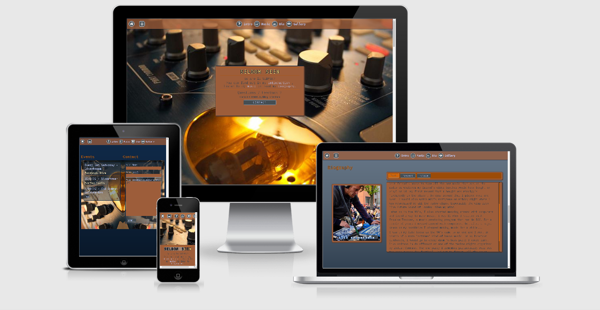

# Seldom Seen electronics

As i am also a music producer , called Seldom Seen , i was in the need of a proper website where users can find more
information about me , listen to my music and hopefully come visit my future perfomances.

## Visit the site in Github pages [here](https://josvelema.github.io/milestone1-UCFD/cd).

## 1. UX

#### 1.2. User Stories

User story’s

-          User#1

As a fan of underground electronic music
i want to find music of that genre
so i can listen and download tracks.

- Features for User#1

Abiliaty to listen to music & soundcloud intergration
Find out about SSE’s music & download/listen

- Value for me
  More listeners of my music

-         User#2

As an visitor of an SSE’s concert
i want to look up more information about SSE
so i can read more about his music and find out about upcoming events

- Features for User#2

Biography section
event section with events in the past (image gallery with captions)
and upcoming events in a calender

- value for me 
gain more fans and more visitors of my events

 -         User#3

As a label owner
i want to contact SSE
so i can invite him to release a track on my label.

- Features for User#3

Feedback ability in music section
contact form

- value for me
 getting my music released

  -        User#4

As an electronic music artist
i want to find fellow producers
so i can exchange knowledge and collaborate

- Features for User#4
Linking the website on soundcloud and facebook
contact/feedback form

- value for me
 make music with other producers

#### 1.3. Wireframes

The wireframes were designed using [Balsamiq](https://balsamiq.com/). They're accessible in the following links:

|                 Desktop                 |             Mobile             |
| :-------------------------------------: | :----------------------------: |
|  [main page](mockups/desktop/file.png)  |  [main page](mockups/mobile/)  |
| [intro page](mockups/desktop/file.png)  | [intro page](mockups/mobile/)  |
| [music page](mockups/desktop/file.pngg) | [music page](mockups/mobile/g) |
| [bio page](mockups/desktop/file.pngpng) | [bio page](mockups/mobile/png) |
| [gallery](mockups/desktop/file.pngpng)  | [gallery](mockups/mobile/png)  |
|  [footer](mockups/desktop/file.pngpng)  |  [footer](mockups/mobile/png)  |

---

## 2. Features

### 2.1. Existing features

**Main page**

- **Welcome / CTA **: welcomes the users and provides a small Call To Action to invite them to look at sections
- **Navigation **: allows users to navigate the site in an easy and intuitive way.

The Navigation is made to be fixed at the top so users can jump to any section with the click on the icos.
In tablet/desktop/large screens the icon's are also provided with text telling the users what section belongs to which icon
The hamburger dropdown is viewable in all screens and also provided with text guiding the users

**Intro page**

- **circle profile image**: shows the user the identity of the artist
- **introduction container**: a short introduction to the users

**Music page**

- **3 soundcloud embedded audiotracks**: allows users to listen to individual tracks
- **soundcloud embedded playlist**: allows users to check out the full soundcloud playlist.

**Biography**

- **image of artist performing**: let the users see a cool photo of an perfomance from the artist
- **biography**: tells users the story of how the artist came to be.
  This article is made to be collapsible and divided into three screens for better UX

**Gallery**

- **Gallery**: allows the users to get to see pictures of the artist

**footer**

- **Contact form**: allows users to contact the artis.
- **Events\_**: allows users to see upcoming events
- **Credits**: allows users to see the credits

### 2.2. Features left to implement in the future

- The form should be submit the forms and send a comfirmation email.
- Add a section with users feedback.
- Allow to play and download music from the website

---

## 3. Technologies used

- [HTML5](https://en.wikipedia.org/wiki/HTML5) - provides the content and structure.
- [CSS3](https://en.wikipedia.org/wiki/Cascading_Style_Sheets) - provides the styling.
- [Bootstrap](https://getbootstrap.com/) - used to create the layout of the project.
- [Balsamiq](https://balsamiq.com/) - used to create the project's wireframes.
- [Gitpod](https://gitpod.io/) - used to develop the website.
- [GitHub](https://github.com/) - used to host the project.
- [Google Fonts](https://fonts.google.com/) - used to provide the fonts IBM plex Mono and Ubuntu to have a coder kind of feel to the letters.
- [Font Awesome](https://fontawesome.com/) - used the font awesome icons in the navigation bar , dropdown and in the carousel.

## 4. Testing

---

## 5. Deployment

**To deploy the project**

This project is hosted in GitHub Pages

1. On the menu on the top of the project’s repository on GitHub select **Settings**.
2. Scroll down to the GitHub **Pages** section.
3. Inside that section, click on the drop-down menu under **Source** and select **Master Branch**.
4. The page refreshes automatically and the website is now deployed.
5. The link to the webpage is just in the GitHub **Pages** section down below.

Only one branch has been used for this project.

**To run the project locally**

To clone this project from GitHub:

1. Under the repository’s name, click **Clone or download**.
2. In the **Clone with hTTPS** section, copy the given URL.
3. In your IDE of choice, open **Git Bash**.
4. Change the current working directory to the location where you want the cloned directory to be made.
5. Type **git clone**, and then paste the URL copied from GitHub.
6. Press **enter** and the local clone will be created.

---

## 6. Credits

### 6.1. Content

The content is written by myself , as I am also the artist. Spell / grammar check by Ingrid Adriaans.

### 6.2. Media

### 6.1. Acknowledgments
